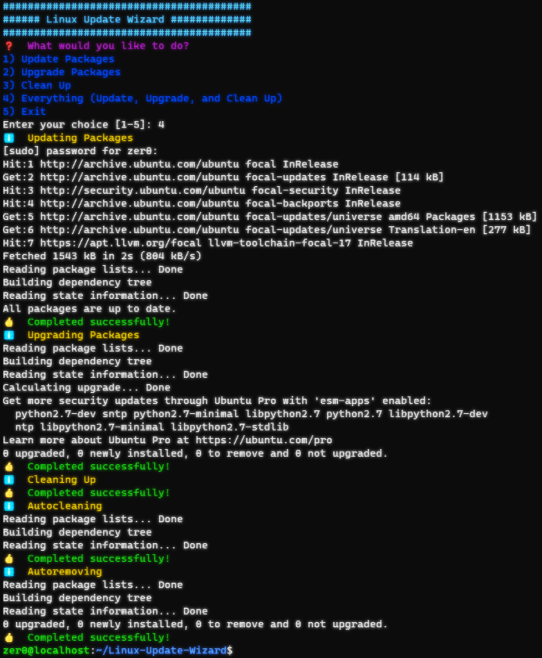

# Linux Update Wizard

## Overview

The Linux Maintenance Wizard is a colorful and interactive Bash script designed to streamline your Linux package management. The script includes options for updating packages, upgrading packages, and cleaning up, all presented in an easy-to-use interactive menu. With colorful text and emojis, this script makes maintaining your Linux system a breeze.



## Features

- 🌈 Colorful and Interactive UI
- ℹ️ Informative prompts and completion statuses
- 🆙 Option for updating packages
- ⏫ Option for upgrading packages
- 🧹 Option for cleaning up
- 📦 Option to perform all the above operations in one go

## Installation

1. Clone the repository:

    ```bash
    git clone https://github.com/R1XY/Linux-Update-Wizard.git
    ```

2. Navigate to the script's directory:

    ```bash
    cd Linux-Update-Wizard
    ```

3. Make the script executable:

    ```bash
    chmod +x update.sh
    ```

## Usage

To run the script, simply execute:

```bash
./update.sh
```

Follow the on-screen prompts to complete the tasks.

## Requirements

- Bash
- sudo access

## Contributing

Feel free to fork the repository and submit pull requests.

## License

This project is licensed under the MIT License - see the [LICENSE.md](LICENSE.md) file for details.
